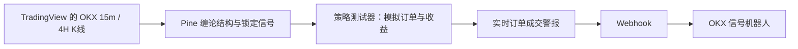

# TradingView 中文策略与买卖信号

本目录提供三套独立 Pine Script v6。**新增的 4 小时定方向、5 分钟找入场、双向杠杆均线策略，使用 `四小时趋势五分钟双向杠杆策略.pine`。** 原有缠论仅做多版和严格过滤版继续保留，各套均有配套信号指标。所有脚本文件名、显示名称和参数使用中文。

只加载指标不会产生策略报告。策略中的 `strategy.entry()` / `strategy.close()` 等指令才会产生模拟交易；`alertcondition()` 用于指标版的独立警报条件。

**新均线版尚待 TradingView 官方编译与历史回测验收。** 本地源码检查和公式验证不替代 Pine 运行。缠论仅做多版已由用户截图确认有模拟订单和策略报告；严格版的 Python 镜像对照与参考导出器测试不代表 OKX 执行联调通过。没有创建实盘警报或连接账户。

## 文件与接入路线

| 文件 | 用途 |
| --- | --- |
| `四小时趋势五分钟双向杠杆策略.pine` | **新增**：4 小时 EMA 方向、5 分钟交叉、双向订单与固定 ATR 止损 |
| `四小时趋势五分钟买卖信号.pine` | 新均线策略的 `alertcondition()` 入场候选提醒 |
| `缠论买点开多卖点平仓策略.pine` | 锁定买点开多、锁定卖点平仓，生成回测报告 |
| `缠论买点开多卖点平仓信号.pine` | 同一套仅做多规则的 `alertcondition()` 买入/卖出警报指标 |
| `缠论严格过滤买卖信号.pine` | 严格版：附加 4H / 结构位 / 净 RR 筛选的警报指标 |
| `缠论严格过滤交易策略.pine` | 严格版：双向交易与固定结构止盈止损策略 |
| `okx_order_fill.example.json` | 创建策略订单成交警报时使用的消息模板，无真实令牌 |
| `export_reference.py` | 使用现有 Python 算法，导出固定起点的逐根参考快照 |

## 新增：四小时趋势、五分钟双向杠杆

打开 `OKX:ETHUSDT.P` 或 `OKX:BTCUSDT.P` 的 **5 分钟标准蜡烛图**，在新建策略中完整粘贴 [四小时趋势五分钟双向杠杆策略.pine](四小时趋势五分钟双向杠杆策略.pine)，保存并添加到图表。策略测试器选择同名策略。不要只复制一段，也不要复制 Markdown 围栏、`**`、`&#x20;` 或转义后的下划线。

| 项目 | 规则 |
| --- | --- |
| 大级别方向 | 最近已收盘 4 小时收盘价高于同根 EMA200 为多头，低于为空头，等于时不开仓 |
| 开多 | 空仓、4 小时多头、5 分钟 EMA9 上穿 EMA21，并且数量足够 |
| 开空 | 空仓、4 小时空头、5 分钟 EMA9 下穿 EMA21，并且数量足够 |
| 固定止损 | 默认 1.5 倍 ATR14，取入场信号时的距离，按最小跳数向上取整，相对模拟成交价设置 |
| 趋势退出 | 持多遇到已确认 4 小时空头则平多；持空遇到多头则平空 |
| 仓位管理 | 单笔持仓、不加仓、不在同一根直接反手；平仓当根跳过新入场，等后续新的交叉 |

当前市场是否上涨由数据计算，不固定写成多头。5 分钟逆向交叉本身不平仓；没有固定止盈，也没有移动止损。大级别中性时不新开仓，已有止损继续有效。关闭“允许新开仓”不停止平仓。关闭 ATR 后计划风险限制也关闭，退出只剩大级别转向及模拟器可能触发的强平。

4 小时请求使用表达式内部的 `[1]` 配合 `lookahead_on`，同时读取已确认收盘价和 EMA；把 `[1]` 写在整个请求后面只是后移一根 5 分钟返回值，不能替代这个处理。新收盘 4 小时数据在随后第一根 5 分钟收盘参与决策，市价单通常下一根开盘成交，因此决策约晚 5 分钟。[TradingView 多周期说明](https://www.tradingview.com/pine-script-docs/faq/other-data-and-timeframes/)

均线方向等待请求上下文中至少 200 根已收盘 4 小时 K 线；没有固定的 2026 年 9 月起点。若无交易，先看状态表是否历史不足、暂停开仓、正在持仓或数量取整为零。200 根 4 小时约为 33 天，实际可用历史由 TradingView 数据及加载范围决定；不会为了生成报告补造订单。

### 杠杆和数量怎么算

初始模拟权益为 **1000 USDT**（默认按图表计价币），单边手续费 **0.05%**、滑点 **2 个价格跳动**。这些是回测假设。策略固定 **10% 保证金要求，即最高 10 倍杠杆机制**；数量用 `qty` 显式计算，不能靠 `default_qty_value=100` 自动得到十倍仓位。[TradingView 杠杆说明](https://www.tradingview.com/support/solutions/43000717375-how-to-simulate-trading-with-leverage-in-pine-script/)

默认每笔“保证金与费用预算”为权益的 **10%**，开启止损时再以 **1% 权益的计划亏损**限制数量，取两种数量中较小者并向下取整。预算数量的计算为：

```text
预算数量 = 权益 × 预算比例 ÷ [参考价 × 点值 × (保证金比例 + 双边手续费率)]
风险数量 = 权益 × 计划风险比例 ÷ [每单位止损损失 + 退出滑点 + 估算双边费用]
有效步长 = 将输入步长向上对齐为图表最小数量单位的整数倍
下单数量 = 两者较小值，按有效步长向下取整
```

例如权益 1000、预算 10%、保证金要求 10%，未受风险限制和数量取整影响前，名义仓位约为 **990 USDT**，并不是 10000 USDT。增加预算可能放大仓位，但风险限制仍可能使数量更小。面板同时显示持仓数量、按现价计算的名义金额、估算所需保证金、名义金额相对权益的倍数。

保证金率、手续费和滑点在文件开头常量中统一定义。若只在“属性”中覆盖它们，代码里的预算估算不会自动同步；应同步修改源码常量并保持属性一致。风险值是下单前估算，下一根开盘价未知，跳空和滑点可能使实际损失超出计划。TradingView 的保证金追缴也不等于 OKX 的真实强平模型。

本版数量为上述线性图表的币数量，默认输入步长 0.001，向上对齐为 `syminfo.mincontract` 的整数倍后使用；这不是已校验的 OKX 合约张数或实盘下单精度。Pine 的杠杆参数不会修改交易所杠杆，策略权益也不是 OKX 实际账户权益。

### 买卖警报与回测成交

要用指定的 `alertcondition()`，另加载 [四小时趋势五分钟买卖信号.pine](四小时趋势五分钟买卖信号.pine)，分别创建“买入信号”“卖出信号”，频率选“每根 K 线收盘一次”。这里买入是开多候选，卖出是开空候选；指标没有模拟持仓、资金预算、止损成交或平仓冷却，所以候选次数不等于策略交易次数。两版均线与预热参数需一致。

回测报告用策略版。需要实际模拟开平仓及止损成交提醒，在策略上创建“仅订单成交”警报，消息填写 `{{strategy.order.alert_message}}`。它区分买入开多、卖出平多、卖出开空、买入平空；`alertcondition()` 只在指标中提供独立条件。[TradingView 警报说明](https://www.tradingview.com/pine-script-docs/concepts/alerts/)

中文通知不是 OKX 下单 JSON。后续对接需验证数量单位、交易所杠杆、消息格式和保护单：本脚本的止损是 TradingView 模拟保护单，不会在开仓时自动托管到 OKX。已有云警报保存旧源码和参数快照，改脚本后需重新创建。

以下是保留的缠论版本说明，使用 **15 分钟图**，不要与上面的均线版周期混用。



Pine 在 TradingView 内重新计算，不调用本机 Flask `/api/kline`。TradingView 策略订单由 broker emulator 模拟，账户实单由接收警报的执行端负责；历史回测不会补发历史实盘订单。[TradingView 策略文档](https://www.tradingview.com/pine-script-docs/concepts/strategies/)说明了模拟撮合，[警报文档](https://www.tradingview.com/pine-script-docs/concepts/alerts/)说明了实时警报与订单成交事件。

## 缠论仅做多版：买点开多、卖点平多

`缠论买点开多卖点平仓策略.pine` 的名称是 **「缠论买点开多卖点平仓策略」**，交易规则与用户给出的均线示例相同，只把金叉/死叉换成缠论买卖点：

- 最新活跃 B2/B3 首次被观察到已锁定，且当前空仓：`strategy.entry("做多", strategy.long)`。
- 最新活跃 S2/S3 首次被观察到已锁定，且当前持多：`strategy.close("做多")`。
- 持多时的新买点不加仓，空仓时的卖点不做空；所有已观察信号都先去重，跳过的信号不会留到以后补单。
- 保留原生包含、成笔、中枢、MACD 背驰、活跃范围和锁定规则。沿用最新候选选择，较新的未锁定候选存在时不会回退交易旧点；不是把全部历史结构点补成交易。
- 本版没有 4H 请求、结构位接近过滤、净 RR 过滤或额外 80 根预热条件。有合法锁定信号即可进入仓位判断。
- 退出仅依赖后续锁定卖点，未添加独立止损、止盈或历史末端强制平仓。因此末端可能保留多单；回测不会为了生成一笔已平仓记录而补造退出。

默认模拟初始资金 10000 USD，每次开仓使用 95% 模拟权益，在策略「属性」中可调整。95% 是资金占用比例，用于留出费用余量，不是最大亏损比例，也不能保证任意跳空下都能成交。默认单边手续费 0.05%、滑点 1 tick；这些是可修改的回测假设。

**加载步骤：**

1. 图表使用 `OKX:ETHUSDT.P` 或 `OKX:BTCUSDT.P` 的 **15 分钟标准蜡烛图**。
2. 将 `缠论买点开多卖点平仓策略.pine` 全文放进 Pine 编辑器，保存并添加到图表。
3. 在策略测试器下拉框选择 **「缠论买点开多卖点平仓策略」**，不要仍选择旧严格版。
4. 右上角核对锁定买/卖点数量、开多/平仓提交、未平仓与已平仓笔数。图上“买点/卖点”表示结构事件，订单箭头与交易列表表示模拟成交。
5. 固定起点默认 `2026-09-01 00:00 UTC`，须已加载并对齐 15 分钟 K 线。若调整起点，整套结构会重算；不能把报告显示的更早日期当作脚本实际参与计算的起点。

本版收盘判定，市场单通常在下一根开盘模拟成交，绝不回填到过去的买卖点极值处成交。“允许开多”关闭后仍会按新锁定卖点平掉已有多单。

需要用户指定的 `alertcondition()` 时，另外加载 `缠论买点开多卖点平仓信号.pine`，创建「买入信号」「卖出信号」两条警报，频率选“每根 K 线收盘一次”。两份使用相同品种、起点和结构参数。指标没有持仓状态，每个锁定卖点表示“有多单时平仓”的提醒，并不保证策略此时有持仓或已成交。

需要与回测成交一致的通知，则在仅做多策略上创建“仅订单成交”警报，消息填写 `{{strategy.order.alert_message}}`。已有警报保留旧源码和参数快照，换版本后需重建。接 OKX 时需使用完整执行消息并另行验证；本次没有创建实盘警报或连接账户。

本地验证：原有 768 根研究样本经真实 `chan.analyze` 固定前缀计算，得到 2 个去重锁定候选，触发 1 次开多，无后续卖点而保持持多。在内存追加连续镜像走势后，共 1536 根，得到 5 个候选，触发 1 次开多、1 次平仓；空仓卖点和持仓中新买点被消费并跳过。订单在下一根开盘改变模拟持仓，没有强制末端平仓。此项验证的是算法事件与持仓状态转换，**不是 Pine 官方编译、当前 ETH 历史回测或收益验证**。

以下章节说明保留的严格版及其研究对照工具。

## 严格版交易规则

范围为 **OKX 的 BTC / ETH USDT 永续，15 分钟标准 K 线，4H 定方向**。过滤基准是 `quant/strategy.py`，不是网页上允许未锁定信号降权的普通决策横幅。

| 条件 | 做多 | 做空 |
| --- | --- | --- |
| 大级别 | 已收盘 4 小时 价格在最新逻辑中枢 ZG 上方 | 已收盘 4 小时 价格在 ZD 下方 |
| 小级别 | 活跃范围内最新 B2 / B3，且已锁定 | 活跃范围内最新 S2 / S3，且已锁定 |
| 位置 | 信号极值接近 4H 中枢边界或最近笔端点 | 对称 |
| 止损 | 信号低点 × 0.998 | 信号高点 × 1.002 |
| 目标 | 预计入场价上方最近 4H 结构位 | 预计入场价下方最近 4H 结构位 |
| 盈亏比 | 预计扣除双边手续费及不利滑点后 ≥ 2 | 对称 |

结构位接近容差沿用近 20 根 4H 的 `(high-low)/close` 均值 × 0.6。没有结构目标、价格已越过止损、大级别中性或冲突，均不入场。最新候选未锁定时，不回退挑选较旧信号。

结构内核保留以下规则：

- 包含处理后识别分型；端点之间含端点至少 5 根处理后 K 线，且端点为完整区间极值。
- 未锁定尾部保留全部已知分型，重选通往最新可达分型的最长合法路径；锁定需要后续至少两笔及极值条件。
- 逻辑中枢固定首三笔区间，九笔之后仍连续延伸，不因九笔上限假造第二个趋势中枢。
- B2 / S2 的来源必须是两个同向不重叠中枢下的趋势背驰，MACD `(10,20,5)`，柱为 `2×(DIF-DEA)`，同向柱面积后/前 `<0.7`。
- B3 / S3 使用离开笔之前已经形成的中枢快照；回踩严格高于 ZG / 回抽严格低于 ZD，触边无效。

本项目仍是“笔近似次级别走势”的量化口径，不是完整递归缠论。评分、KDJ/RSI 共振、线段图层及九笔原子框的装饰不参与严格量化过滤，Pine 没有移植这些显示功能。

**订单规则是新增的研究约定：** 收盘决定，常规下一根开盘模拟成交；只允许一笔持仓，不加仓、不直接反手；入场提交时同时提交固定结构止损和止盈，后续不移动。尚未定义“12 根未启动”的可计算条件，因此没有时间止损、反向信号退出或跟踪止损。同一信号首次通过过滤后就消耗；即使当时已有持仓，也不会在后来平仓后重复使用。

计划风险默认是策略模拟权益的 0.5%，按止损距离和费用反算数量，名义本金不超过模拟权益，并预留手续费。下一根开盘跳价会改变实际风险和盈亏比，0.5% 不是实际亏损保证上限。它也不是按真实 OKX 账户权益动态调仓。

## 在 TradingView 加载

1. 打开 `OKX:ETHUSDT.P` 或 `OKX:BTCUSDT.P`，选 **15 分钟、标准蜡烛图**。
2. 使用独立买卖警报时，新建指标并完整粘贴 `缠论严格过滤买卖信号.pine`；回测时新建策略并完整粘贴 `缠论严格过滤交易策略.pine`。两个文件各自完整，不要拼接在一起。
3. 在设置里选择固定历史起点 `固定历史起点`。默认 `2026-09-01 00:00 UTC`；起点须是 UTC 的 00 / 04 / 08 / 12 / 16 / 20 点，且两种周期都必须加载到该根 K 线。历史不足时选择更晚的共同起点，再重新评估结果。
4. 预热至少 40 根 4H 和 80 根 15m。没有信号时先看右上角状态和数据窗口中的 `audit.reason`，不要为了增加交易次数降低锁定或 RR 要求。
5. 策略版可查看策略测试器的交易列表：入场不能早于锁定信息实际可用的收盘；检查手续费、滑点、持仓和退出价格。指标版只提供图上信号和警报条件，不生成回测交易。

图上蓝色阶梯线为 15m 逻辑中枢边界，橙色为已经确认的 4H 边界，红/绿线为本次订单固定止损/止盈。黄线展示新锁定事件对应的末笔；同一事件锁定多笔时只画最新一笔，并非完整笔图。`B2/B3/S2/S3 · 已锁定` 标签画在策略观察到锁定信号的 K 线上，**不回填到历史极值处冒充可成交点**；标签出现不等于其他入场过滤已经全部通过。

### 指标版：使用 alertcondition 创建买入 / 卖出警报

`缠论严格过滤买卖信号.pine` 第一行是 `//@version=6`，第二行是 `indicator(...)`。它保留策略版相同的缠论结构、锁定、4H 方向、结构位、净盈亏比过滤和候选去重，提供两个全局 `alertcondition()`：**买入信号**、**卖出信号**。

1. 加载指标「缠论严格过滤买卖信号」，在「买卖信号」设置中开启提醒。
2. 创建警报，条件选择该指标，再选择 **买入信号**，频率选择 **每根 K 线收盘一次 / Once Per Bar Close**。
3. 再创建一条警报，选择 **卖出信号**，同样选择收盘一次；按需启用手机通知或弹窗。

默认消息包含品种、收盘价、结构止损、目标和净盈亏比。`alertcondition()` 的消息是常量模板，动态数值通过 `{{close}}`、`{{plot("audit.stop")}}` 等 TradingView 占位符替换，用户可在警报对话框中修改正文。源码只定义条件，仍需完成上述创建警报步骤。[TradingView 警报与占位符说明](https://www.tradingview.com/pine-script-docs/concepts/alerts/)

绿色「买入」是已锁定 B2/B3 做多候选；红色「卖出」是已锁定 S2/S3 做空候选。只在首次通过全部候选过滤的收盘 K 线上标记，同一候选不会持续重复提醒。指标的本图结构也只在收盘更新；面板保留最近收盘结论。历史数据会显示标记，不补发历史警报。

指标没有持仓、订单数量和模拟成交状态，所以候选条数不等于策略成交条数，「卖出信号」不代表平多。图上标记开关只控制显示，提醒开关只控制警报。改变源码、输入、品种或周期后需重建警报，已有云警报仍使用创建时快照。两版逐根对照时，品种、周期、固定起点和过滤参数必须相同；维护代码时需同步结构内核和候选过滤。

`strategy()` 中的 `alertcondition()` 不能创建这些独立警报条件，因此指标版使用 `indicator()`。回测与原来的 OKX 策略订单成交 JSON 使用策略版；指标提醒没有开平仓成交与 `strategy.*` 占位符，不能直接套用该 JSON。

### 策略版：alert() 信号提醒与订单成交提醒

新增绿色「买入」和红色「卖出」标记，画在信号首次通过全部候选过滤的收盘 K 线上：买入对应已锁定 B2/B3 做多候选，卖出对应已锁定 S2/S3 做空候选。同一候选只标记、提醒一次，不回填到历史极值处。

1. 策略设置的「买卖信号」中，打开「显示买入 / 卖出标记」与「启用买卖信号提醒」，选择提醒方向。
2. 点击 TradingView「创建警报」，条件选择本策略，再选 **仅 alert() 函数调用 / alert() function calls only**。勾选所需的应用通知、弹窗等方式。
3. 提醒正文由脚本生成，包含买入/卖出、品种、B2/B3/S2/S3、收盘价、结构止损、目标和净盈亏比。仅在实时 K 线收盘触发；加载历史数据会画标记，不会补发历史提醒。

Pine 策略应使用 `alert()` 发送这类提醒。示例中的 `alertcondition()` 可以写入策略，但不能用于创建策略警报；它的独立条件选择用于指标脚本。参见 [TradingView 警报文档](https://www.tradingview.com/pine-script-docs/concepts/alerts/)。如果需要分别管理买入和卖出通知，先选择「仅买入」创建一条警报，再选择「仅卖出」创建另一条。云警报保存创建时的设置快照，修改源码或参数后需要删除并重建。

显示开关只控制图上标记，提醒开关与方向只控制信号通知，均不改变回测订单。**候选提醒也会在已有模拟持仓或暂停新增订单时发出**；是否提交订单还需检查空仓、可用权益、数量精度和取整后的盈亏比。因此「买入/卖出」不等于已成交，「卖出」也不是平多指令；平仓仍按原来的固定结构止盈/止损执行。

若需要开仓、平仓的成交提醒，另外创建 **仅订单成交 / Order fills only** 警报，消息填写：

```text
{{strategy.order.alert_message}}
```

该提醒会区分「买入开多」「卖出平多」「卖出开空」「买入平空」，表示 TradingView 模拟撮合事件。接 OKX 自动交易时，使用下文完整 JSON 模板；不要把上述中文候选提醒或中文成交消息作为 OKX 执行消息。

### 有结构标签，却没有买卖成交记录

先确认加载的是「缠论严格过滤交易策略」。指标版的 `alertcondition()` 不会产生策略测试器成交记录；均线示例能显示交易，是因为其中执行了 `strategy.entry()` 和 `strategy.close()`。

若报告面板已显示策略名称，却提示「本报告需要交易数据」，表示所选策略在当前回测中还没有可供报告的交易，并不是缺少某个警报函数。图上 `B3 · 已锁定` 只证明出现过结构锁定点，不能证明该点通过了入场筛选或订单已成交。[TradingView 无订单排查说明](https://www.tradingview.com/support/solutions/43000478450-i-ve-successfully-added-a-strategy-to-my-chart-but-it-doesn-t-generate-orders/)

状态表在最后一根历史收盘 K 线初始化，因此首次加载不必等待下一根 15 分钟 K 线收盘。若表格未显示，在设置的「显示」中勾选「显示中文状态面板」。这是显示修复，不改变信号判断、下单时间或回测交易。

策略版面板按固定起点统计：

- **历史锁定候选 买 / 卖**：收盘时观察到的活跃、最新、已锁定 B2/B3/S2/S3，按候选去重；不是所有原始结构点的总数。
- **历史过滤通过 买 / 卖**：这些候选首次通过全部方向、位置、止损、目标和净盈亏比过滤的次数，不受提醒/绘图开关影响。
- **历史入场提交 多 / 空**：实际调用模拟入场指令的次数；仍可能与撮合结果不同，尤其最后一根提交的市价单尚未成交。
- **已平仓笔数**：TradingView 模拟器的 `strategy.closedtrades`。正在持仓时可能仍为 0。

锁定候选有数量而过滤通过为 0，表示尚未得到符合严格规则的入场候选；过滤通过有数量而提交为 0，再检查暂停新增订单、已有模拟持仓、权益、价格取整后的净 RR 与数量步长。候选与成交不能混作同一计数。

指标版也显示前两项历史统计，以及最近一次检查锁定候选时的时间和过滤状态。鼠标悬停「二买 B2 · 已锁定」等标签，可看首次观察时的过滤原因。当前面板“暂无活跃信号”只描述最近收盘，不代表全部历史没有信号；当前“4H 中性”也不能解释之前某个买点当时为什么被过滤。

两版均不为生成交易记录而改用均线交叉或绕过缠论过滤。若严格条件未出现，零次交易是可能的结果；统计窗口、数据与规则需要一起核对。

### 重复出现 CE10244 时的编译诊断

完整缠论源码包含下单和全局绘图；仅凭 CE10244 不能判断用户编辑器内哪段代码缺失。
在一个**新建的空白策略**中，仅粘贴 `脚本编译检查.pine` 的三行并添加到图表。
它只画收盘价、不产生订单，不是缠论策略，也不用于验证收益。

```pine
//@version=6
strategy("脚本编译检查", overlay=true)
plot(close, title="收盘价", color=color.blue)
```

三行均从行首开始，不要粘贴 Markdown 代码围栏、`**` 或 HTML 空格实体。
它在任何普通品种/周期都可用于检查，不需要切换到缠论策略限定的品种/周期。
若三行通过，则继续核对完整策略实际粘贴内容及首个错误；若同样显示 CE10244，
需检查正在编译的是否确为这三行、保存是否生效，以及编辑器是否还有其他诊断。
回报时附当前编辑器前 10 行、最后 10 行和总行数，避免继续根据本地文件猜测。
官方 [策略声明规则](https://www.tradingview.com/pine-script-docs/language/declaration-statements/)
说明，策略包含绘图输出即可满足此项要求，无须为消除错误添加虚假订单。

### 成本与数量设置

- 策略属性的手续费默认 **单边 0.05%**。调整后也要同步 `盈亏比筛选：单边手续费（%）`，两处不会自动联动。
- 策略测试器滑点默认 **1 个最小价格跳动**；`盈亏比筛选：不利滑点（%）` 默认 **0.05%**，只用于候选过滤和计划仓位。这是两种不同模型，修改百分比不会改变回测成交滑点。回测需要在属性中另设合理 ticks；不能将 1 tick 当成 0.05%。
- 当前没有历史资金费、完整强平模型、盘口冲击、拒单或网络延迟模拟。
- `模拟下单数量步长` 默认 0.001，是可修改的研究值，**不是已核实的 OKX 下单精度**。对接前按当前合约的币数量步长和最小数量校验；合约张数、币数量和 USDT 金额不能混用。
- 脚本限定 `syminfo.pointvalue == 1` 的上述线性永续图表。这个检查不能代替 OKX 的 `ctVal`、`lotSz`、`minSz` 核对。

## 与本地网页为何可能不同

| 项目 | 现有 Python 网页 / 回放 | 本 Pine 初版 |
| --- | --- | --- |
| 历史起点 | 网页约 1200 根、研究默认 600 根滚动 | 明确固定起点，向右追加 |
| MACD 初值 | 随输入窗口第一根重新初始化 | 从固定起点初始化 |
| 新 4H 数据可用性 | 回放在同一 15m / 4H 收盘采纳 | 下一根 15m 收盘才采纳，延后 15 分钟 |
| 订单 | Python 原回放只有候选，没有撮合收益 | TradingView 模拟成交、固定止盈止损 |
| 数据 | OKX API 输入 | TradingView 的 OKX 图表数据，须逐根核对 |

HTF 使用官方的 `expression[1] + barmerge.lookahead_on` 组合；**不能删除 `[1]`**，否则可能将 4H 未来收盘数据提前放进历史回测。[TradingView 防重绘说明](https://www.tradingview.com/pine-script-docs/concepts/repainting/#repainting-request-security-calls)

因此不能把默认网页上的信号与 Pine 直接宣称为一一对应。需要相同数据、相同历史起点、相同 HTF 时序进行逐根验证。修改起点会重算结构，不是无影响的“多加载一些历史”。

资源上限默认每个周期 12000 根原始 K、250 个可调整尾部分型。超过上限、数据缺口或缺失起点会报错停止，**不会悄悄截断历史或简化算法**。Pine 还受平台自身执行时间及内存限制；输入上限不是平台性能保证。[Pine 限制说明](https://www.tradingview.com/pine-script-docs/writing/limitations/)

停止运行也会影响后续平仓警报，不会自动平掉 OKX 的实际持仓。因此这个固定起点初版不能未经运行期验证就当作永久无人值守机器人。

## Python 对照工具

准备本项目量化 JSON 格式的历史数据，包含 `inst`、`15m`、`4H`，每根有 `ts/o/h/l/c/vol/confirm`。时间为 UTC 毫秒开盘时间；两种周期都需要包含同一个固定起点，升序、连续且数值有效，末尾未收盘 K 自动排除。工具使用现有 `chan.analyze` 与 `quant.strategy.evaluate`，不连接网络、数据库或账户。

在项目目录执行：

```bash
.venv/bin/python tradingview/export_reference.py var/history.json --start 2026-09-01T00:00:00Z --output var/tradingview-reference.jsonl
```

修改 Pine 的过滤成本后，可追加 `--fee-rate 0.0005 --slippage-rate 0.0005 --min-net-rr 2`；
命令行费率是小数比例，`0.0005` 对应 Pine 输入中的 `0.05%`。

这条命令需要已有真实的 `var/history.json`；项目不附带该数据文件。导出前先确认它与 TradingView 图表 OHLC 和起点一致。工具不滚动裁切历史，按 `4H close <= 15m open` 对齐可见性；长历史可能较慢。中断留下的部分输出不能当作完整结果。

从 TradingView 导出含指标数据的图表 CSV（若账户支持），按图表 K 线**开盘时间**与 JSONL 的 `small_open_ts` 对齐。先核对结构和时序，再看盈亏。

| Pine 数据窗口 / 导出列 | Python 参考字段 |
| --- | --- |
| `audit.signal_type` | `selected_signal.type`：B2=2、B3=3、S2=-2、S3=-3；无信号为0 |
| `audit.signal_ts` / `audit.signal_price` | `selected_signal.ts` / `selected_signal.price` |
| `audit.signal_locked` | `selected_signal.locked`，0/1 |
| `audit.active_cutoff_ts` | `active_cutoff_ts` |
| `audit.big_closed_at` | `big_closed_at` |
| `audit.action` | `action`：long=1、short=-1、wait=0，候选去重后 |
| `audit.stop` / `audit.target` / `audit.net_rr` | `stop` / `target` / `net_rr` |
| `audit.order_action` | 本工具无对应字段：这才是实际提交给 TV 模拟器的入场方向 |

`audit.reason`：0 合格候选；1 预热；2 无活跃二三类点；3 未锁定；4 方向中性/冲突；5 远离结构位；6 止损已失效；7 无结构目标；8 净 RR 不足；9 候选已经使用。

参考 JSONL 只输出双周期预热完成之后的数据，`raw_action` 保留去重前候选；它没有模拟持仓，不能用候选条数当成交条数。`audit.action` 也可能因已有持仓、数量不足、价格取整后 RR 不合格或关闭入场而没有产生订单。

本地验证记录：参考导出器的 7 项测试覆盖 HTF 边界、固定历史与起点、尾部未收盘排除、去重、坏数据和成本参数；项目 Python 回归通过（2 项环境集成测试跳过）。迁移算法另用 Python 镜像对照了 2868 根逐前缀端点/锁定、382 个中枢和信号快照（228 条信号记录）。**镜像运行不等于 Pine 编译或运行，也未证明两端市场数据一致。**

```bash
.venv/bin/python -m unittest tests.test_tradingview_reference -v
```

## 回测验收后接 OKX

按 [OKX 官方接入教程](https://www.okx.com/help/how-to-set-up-signal-trading-bot-with-tradingview)创建信号，使用该页面给出的 Webhook URL 和 signalToken。机器人功能是否可用以账户实际页面为准。

1. 核实图表品种、数量单位与机器人一致，两端从空仓开始，关闭多次入场。
2. 在 TradingView 为本策略创建警报，选 **仅订单成交 / Order fills only**；不要同时把普通 `alert()` 事件送给同一执行器。
3. 将 `okx_order_fill.example.json` 全文放入警报的 Message，替换示例 token；Webhook URL 使用 OKX 页面提供的地址。模板对应 OKX 的 Pine 策略 Section A 格式。
4. `investmentType: "base"` 与 `amount: "{{strategy.order.contracts}}"` 按币数量发送。检查机器人设置是否覆盖信号金额，并核对最小数量和每次实际成交。
5. 先验证可用的模拟环境或只记录消息的接收端，再逐项验收入场、止盈、止损、重复消息和拒单。没有完成这些验证前，不将本研究初版视为已具备可靠自动执行能力。

消息占位符必须放在警报 Message 中，不能复制进 `strategy.entry(..., alert_message=...)` 后期待再次解析。脚本、输入、品种或周期改变后需要重建警报；已建立的云警报保留创建时快照。[TradingView 订单警报说明](https://www.tradingview.com/pine-script-docs/concepts/alerts/#order-fill-events)

本模板仅表达订单成交，不携带每笔动态结构止损。[OKX 消息规范](https://www.okx.com/help/signal-bot-alert-message-specifications)定义了动作、仓位和数量字段；`signalToken` 只填在用户自己的警报中，不写进源码或版本库。

### 实盘执行仍需解决的边界

- `strategy.exit` 是 TV 模拟保护单。TV 模拟止损成交后才通过 webhook 发出平仓，**不会在入场时把本笔结构止损托管到交易所**。若需要精确的交易所原生结构保护单，还需增加执行服务：接收计划价格、处理真实成交回报、提交保护单并对账；本目录未实现该服务。OKX 机器人自身的固定 TP/SL 设置与这里的动态结构止损并不等价。
- `strategy.position_size` 和 `strategy.equity` 来自模拟器，不能回读 OKX 实际账户。漏发、拒单、部分成交、机器人独立止损和人工平仓都可能让两端仓位不同。异常后需暂停新入场并核对仓位；本版没有自动对账、全账户日/周熔断或跨币种组合风险管理。
- TradingView 明确提示 webhook 可能发送失败。自建接收端要快速接收、异步处理、去重和记录；80/443 端口、3 秒响应限制及两步验证要求见 [官方 Webhook 文档](https://www.tradingview.com/support/solutions/43000529348-how-to-configure-webhook-alerts/)。

当前交付的是策略源码、参考工具和接入模板；官方编译、真实数据回测、稳定性观察和执行联调仍须完成后才能讨论收益及实盘可靠性。
